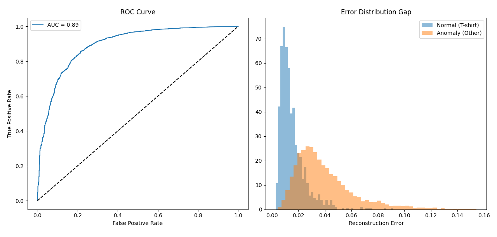

# Convolutional VAE Anomaly Detection

This project implements an **unsupervised anomaly detection system** using a **Variational Autoencoder (VAE)**. The model learns a compressed representation of a *normal* data class and identifies anomalies based on reconstruction failure.

## 1. Project Overview

The goal is to train a model on a **single category** of data (e.g., T‑shirts from Fashion‑MNIST) so it becomes an expert at reconstructing that specific shape.

When the model encounters unseen categories (e.g., ankle boots or bags), it fails to reconstruct them accurately.  
This reconstruction failure becomes the **anomaly score**.

## 2. Technical Architecture

The project evolved from a fully connected VAE to a **Deep Convolutional VAE (ConvVAE)** to better capture spatial structure in Fashion‑MNIST.

### Encoder
- Stack of `Conv2d` layers that downsample the image.
- Learns structural features such as necklines, sleeves, and hems.

### Latent Space
- A **128‑dimensional bottleneck**.
- Represents each image as a probability distribution with parameters μ and σ.

### Decoder
- `ConvTranspose2d` layers reconstruct the image from latent coordinates.

## 3. The Anomaly Detection Pipeline

### A. Training (One‑Class Learning)

The model is trained **only on normal samples**.

**Loss Function:**

$$Loss = \text{BCE}(x, \hat{x}) + \text{KLD}(q(z|x) || p(z))$$

### B. Inference & Scoring

During testing, both normal and anomalous images are passed through the model.

- Compute **Mean Squared Error (MSE)** between input `x` and reconstruction $\hat{x}$.
- **Low error:** Normal sample  
- **High error:** Anomalous sample

## 4. Key Performance Metrics

- **AUROC: 0.89**  
  Indicates an 89% probability that a randomly chosen anomaly has a higher error score than a normal sample.

- **Error Distribution Gap**  
  Clear separation between normal and anomaly histograms, enabling threshold selection for deployment.

